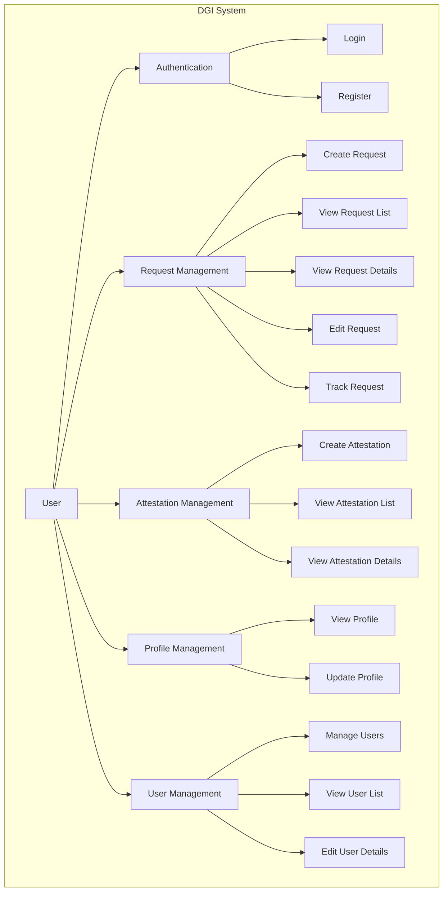
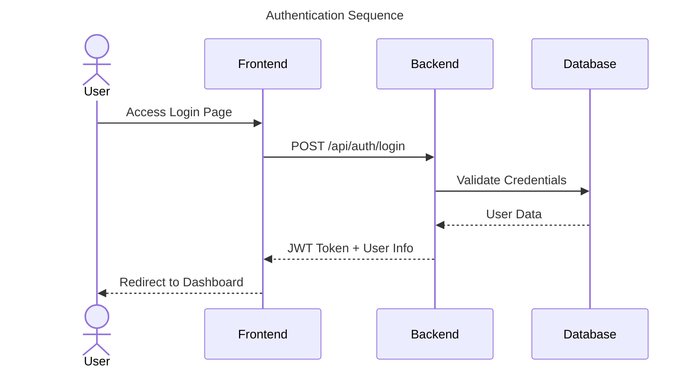
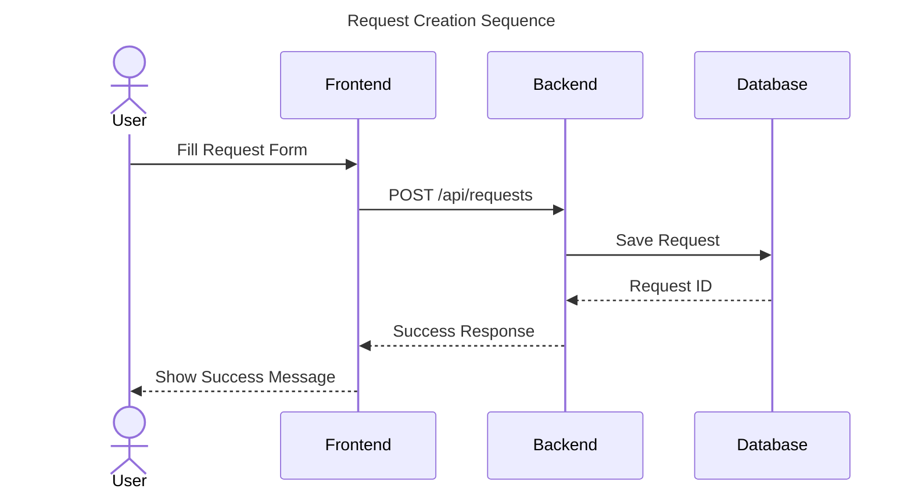
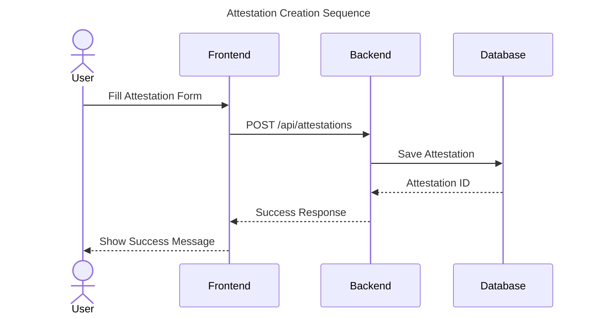
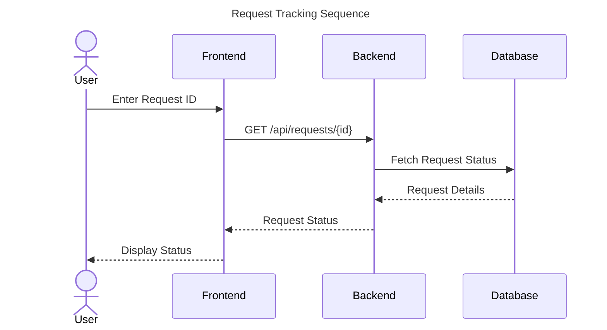
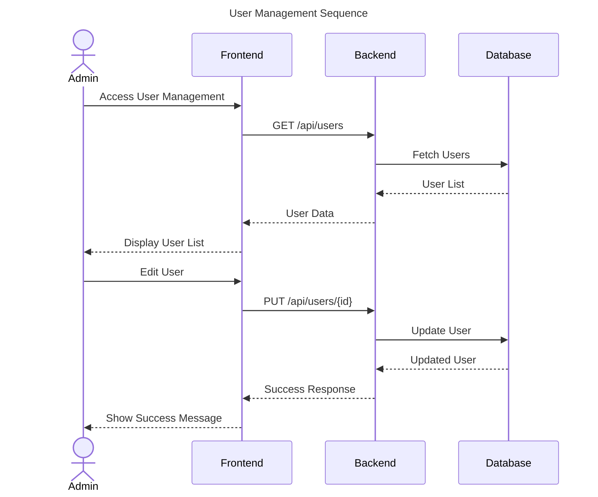
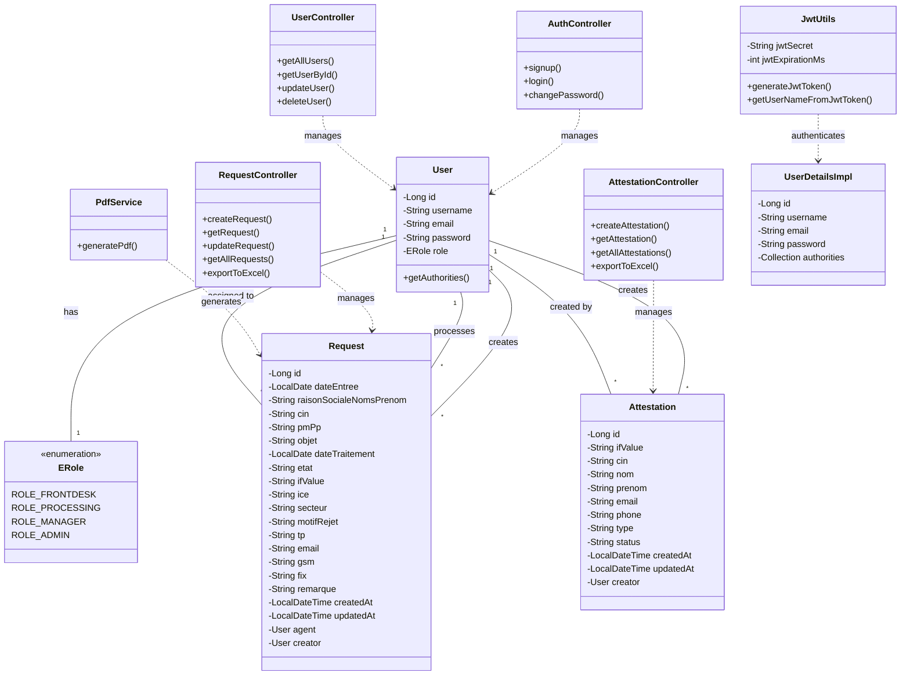

# DGI Application Diagrams

## Use Case Diagram

## Sequence Diagrams

### Authentication Sequence

### Request Creation Sequence

### Attestation Creation Sequence

### Request Tracking Sequence

### User Management Sequence

## Class Diagram

